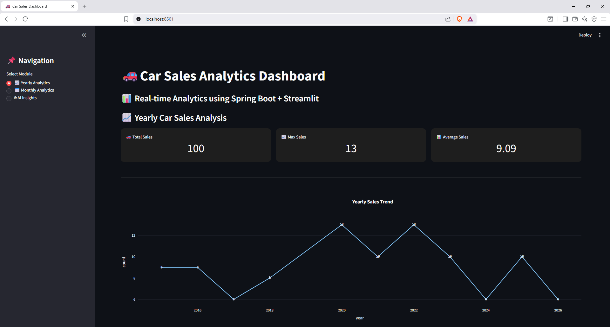
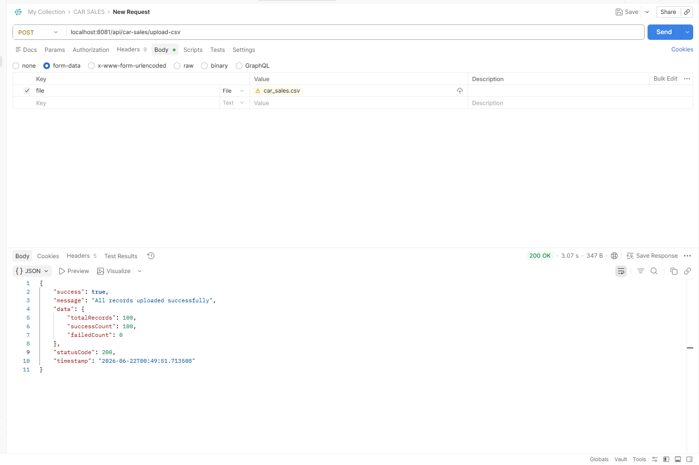
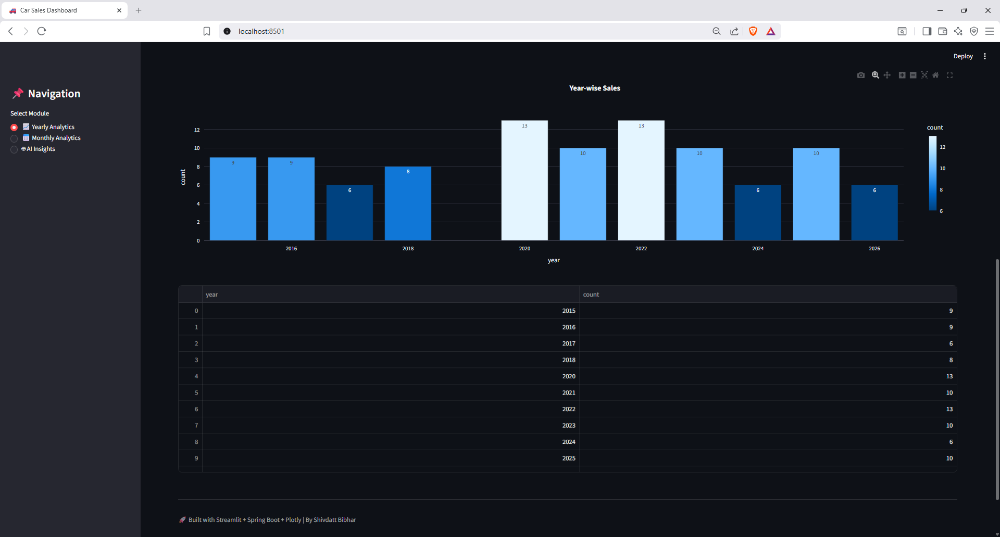
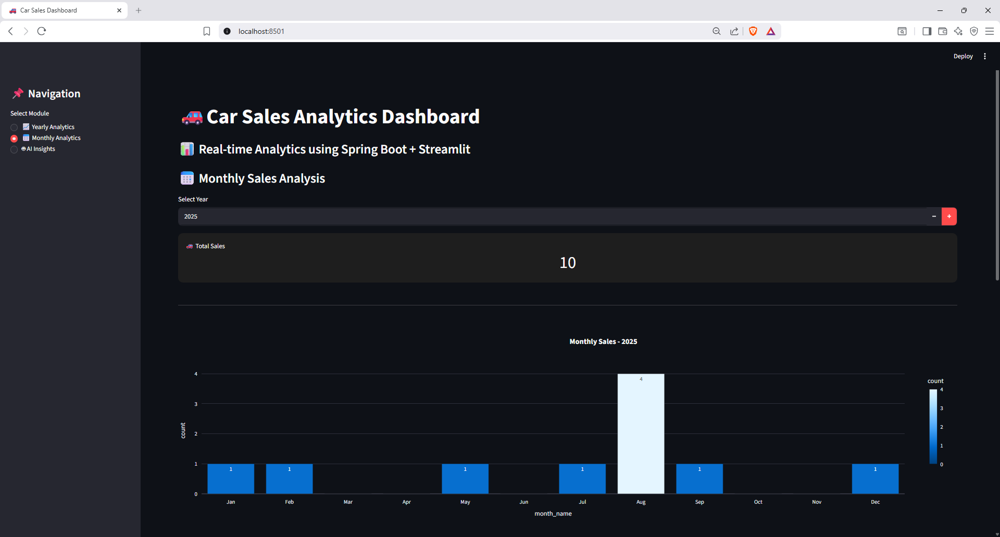
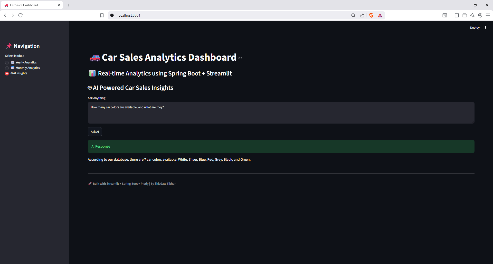

# 🚗 AI-Powered Car Sales Analytics Platform

<p align="center">


</p>

> **Intelligent Business Analytics using Spring Boot, Spring AI, Meta Llama 3, Ollama, Streamlit, and Docker**

---

# 📑 Table of Contents

- [Overview](#-overview)
- [Features](#-features)
- [Architecture](#-architecture)
- [Tech Stack](#-tech-stack)
- [Project Structure](#-project-structure)
- [Application Workflow](#-application-workflow)
- [REST API Endpoints](#-rest-api-endpoints)
- [Screenshots](#-screenshots)
- [Installation](#-installation)
- [Environment Variables](#-environment-variables)
- [Learning Outcomes](#-learning-outcomes)
- [Future Enhancements](#-future-enhancements)
- [License](#-license)

---

# 📌 Overview

The **AI-Powered Car Sales Analytics Platform** is a full-stack business intelligence application that combines modern backend engineering, AI integration, and interactive data visualization into a single platform.

The application allows users to upload vehicle sales datasets, visualize sales trends through interactive dashboards, and retrieve business insights using natural language queries.

Instead of manually writing SQL queries, users simply ask questions in plain English.

The application uses **Spring AI** integrated with **Meta Llama 3**, running locally through **Ollama**, to convert natural language into SQL queries, validate them, execute them against the MySQL database, and generate concise business insights.

Running the model locally provides:

- 🔒 Privacy
- 🌐 Offline capability
- 💰 Zero API costs
- ⚡ Faster experimentation
- 🎯 Full control over AI inference

The project follows a modular full-stack architecture with a Spring Boot backend, Streamlit frontend, Docker-based deployment, and environment-driven configuration, making it suitable for both local development and future cloud deployment.

---

# ✨ Features

## 📂 Data Processing

- Upload vehicle sales data through CSV
- Automatic CSV parsing
- Data validation before insertion
- Duplicate record prevention
- Batch insertion into MySQL
- Structured exception handling

---

## 📊 Business Analytics

Interactive dashboard built using **Streamlit** and **Plotly**.

### Features

- Year-wise sales analysis
- Month-wise sales analysis
- KPI summary cards
- Sales trend visualization
- Interactive charts
- Dynamic filtering
- Real-time analytics

---

## 🤖 AI Business Assistant

Powered by **Spring AI** + **Meta Llama 3** through **Ollama**

### Features

- Natural language querying
- Prompt engineering
- AI-generated SQL
- SQL validation before execution
- Safe database querying
- AI-generated business summaries
- Human-readable responses
- Local LLM inference without cloud APIs

### Example Questions

```
Which year had the maximum sales?

Show monthly sales for 2023.

Which vehicle manufacturer performed best?

Summarize overall business performance.
```

---

## 🔗 REST API

The backend exposes RESTful APIs for:

- CSV upload
- Sales analytics
- AI-powered querying
- Dashboard integration

---

# 🏗️ Architecture

```
                    +----------------------+
                    |  Streamlit Dashboard |
                    +----------+-----------+
                               |
                               ▼
                    +----------------------+
                    | Spring Boot REST API |
                    +----------+-----------+
                               |
            +------------------+------------------+
            |                                     |
            ▼                                     ▼
+-------------------------+         +--------------------------+
|     MySQL Database      |         | Spring AI + Ollama       |
+-------------------------+         +------------+-------------+
                                                 |
                                                 ▼
                                          Meta Llama 3
                                                 |
                                                 ▼
                                        AI Generated SQL
                                                 |
                                                 ▼
                                        Business Insights
```

---

# 🛠 Tech Stack

## Backend

- Java 21
- Spring Boot
- Spring AI
- Spring Data JPA
- Hibernate
- Maven
- JDBC Template
- Apache Commons CSV
- Lombok

### Frontend

- Python
- Streamlit
- Plotly
- Pandas
- Requests

### AI

- Meta Llama 3
- Ollama
- Spring AI
- Prompt Engineering
- Natural Language to SQL

### Database

- MySQL

### DevOps

- Docker
- Docker Compose

### Tools

- Git
- GitHub
- IntelliJ IDEA
- VS Code
- Postman

---

# 📁 Project Structure

```
ai-car-sales-analytics/
│
├── backend/
├── frontend/
├── dataset/
├── screenshots/
├── docker-compose.yml
├── .env.example
├── .gitignore
├── LICENSE
└── README.md
```

---

# 🔄 Application Workflow

## Dataset Upload

```
CSV File
    │
    ▼
Spring Boot
    │
    ▼
Validation
    │
    ▼
MySQL Database
```

---

## Analytics

```
MySQL Database
      │
      ▼
REST APIs
      │
      ▼
Streamlit Dashboard
      │
      ▼
Interactive Charts
```

---

## AI Query Processing

```
User Question
      │
      ▼
Spring Boot
      │
      ▼
Spring AI
      │
      ▼
Prompt Engineering
      │
      ▼
Meta Llama 3 (Ollama)
      │
      ▼
Generate SQL
      │
      ▼
SQL Validation
      │
      ▼
Execute SQL
      │
      ▼
Retrieve Results
      │
      ▼
Generate Business Summary
      │
      ▼
Natural Language Response
```

---

# 📡 REST API Endpoints

| Method | Endpoint | Description |
|---------|----------|-------------|
| POST | `/api/car-sales/upload-csv` | Upload CSV dataset |
| GET | `/api/car-sales/yearly-count` | Year-wise analytics |
| GET | `/api/car-sales/monthly-count` | Month-wise analytics |
| POST | `/api/ai/ask` | AI-powered business query |

---

# 📸 Screenshots

## Dashboard

```
screenshots/dashboard.png
```

```markdown

```

---

## CSV Upload

```markdown

```

---

## Year-wise Analytics

```markdown

```

---

## Month-wise Analytics

```markdown

```

---

## AI Business Assistant

```markdown

```

---

# ⚙️ Installation

## Prerequisites

- Java 21
- Maven
- Python 3.11+
- MySQL
- Docker
- Docker Compose
- Ollama

---

## Clone Repository

```bash
git clone https://github.com/shivdatt23/ai-car-sales-analytics.git

cd ai-car-sales-analytics
```

---

## Pull Llama 3

```bash
ollama pull llama3
```

---

## Start Ollama

```bash
ollama serve
```

---

## Configure Environment

```bash
cp .env.example .env
```

---

## Build & Run

```bash
docker compose up --build
```

---

### Backend

```
http://localhost:8081
```

### Frontend

```
http://localhost:8501
```

---

# 🔐 Environment Variables

```properties
DB_URL=jdbc:mysql://mysql:3306/car_sales
DB_USERNAME=root
DB_PASSWORD=your_password

OLLAMA_BASE_URL=http://host.docker.internal:11434
OLLAMA_MODEL=llama3

BASE_URL=http://backend:8081/api
```

---

# 🎯 Learning Outcomes

Through this project, I gained practical experience in:

- Designing scalable RESTful APIs using Spring Boot
- Integrating AI capabilities with Spring AI and Meta Llama 3
- Implementing Natural Language to SQL workflows
- Building interactive analytics dashboards using Streamlit and Plotly
- Processing and validating CSV datasets efficiently
- Managing relational data with MySQL and Spring Data JPA
- Containerizing applications using Docker and Docker Compose
- Configuring applications securely using environment variables
- Developing modular full-stack applications with Java and Python

---

# 🚀 Future Enhancements

- JWT Authentication & Authorization
- Role-Based Access Control (RBAC)
- Swagger/OpenAPI Documentation
- Export Reports (PDF/Excel)
- Redis Caching
- GitHub Actions CI/CD Pipeline
- Kubernetes Deployment
- AWS / Azure / GCP Deployment
- Retrieval-Augmented Generation (RAG)
- Vector Database Integration
- Unit & Integration Testing
- Monitoring with Prometheus & Grafana

---

# 📜 License

This project is licensed under the **MIT License**.

---

## ⭐ Support

If you found this project useful, consider giving it a **⭐ Star** on GitHub!
